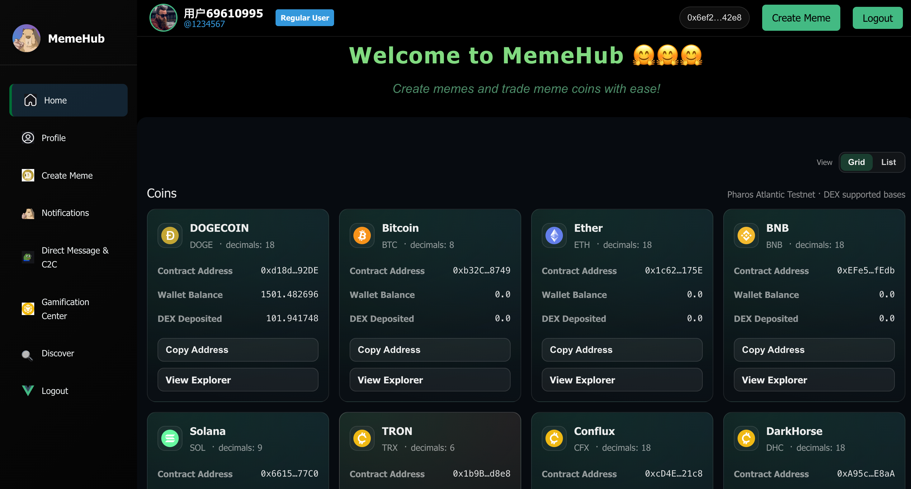
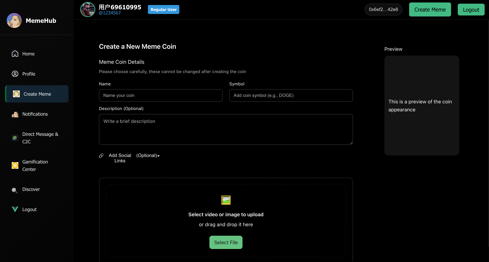
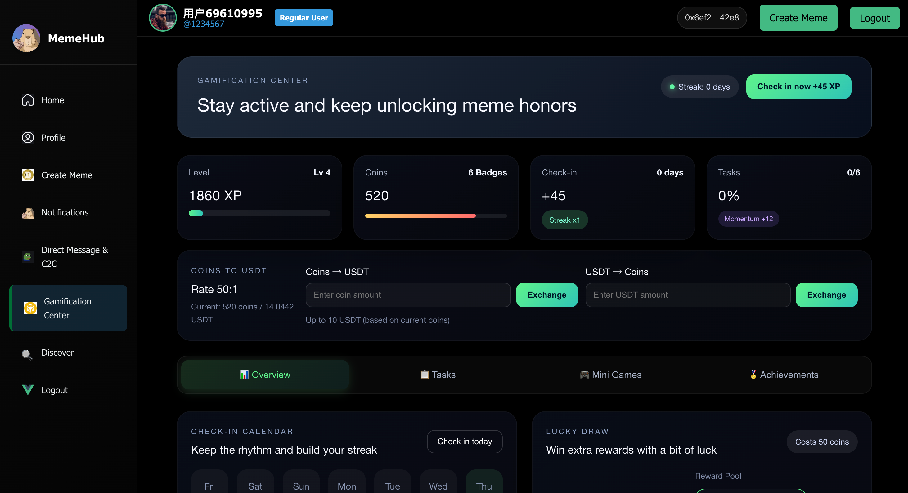
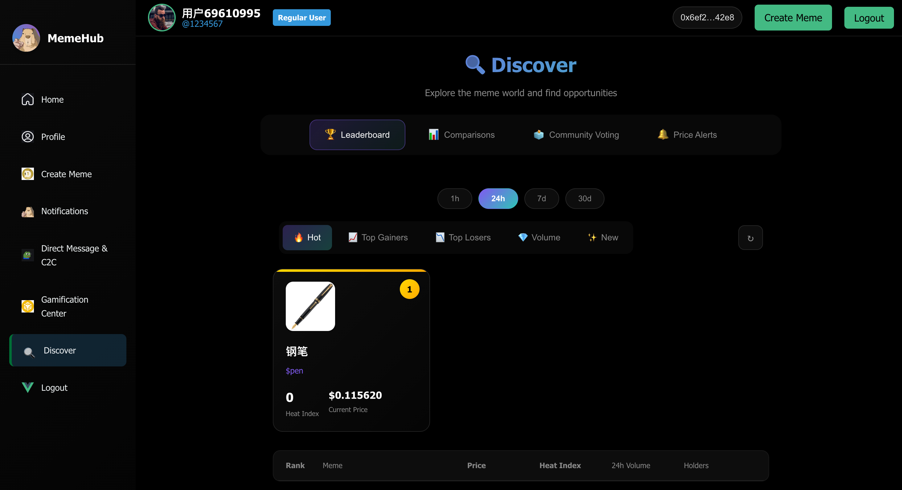
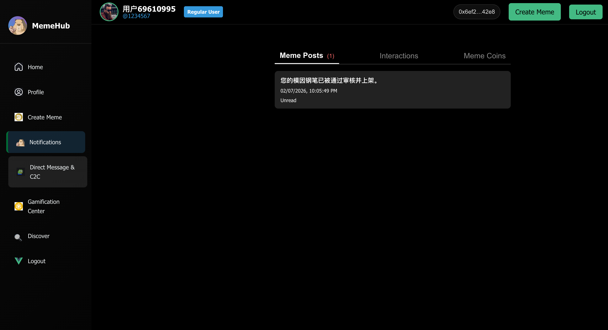
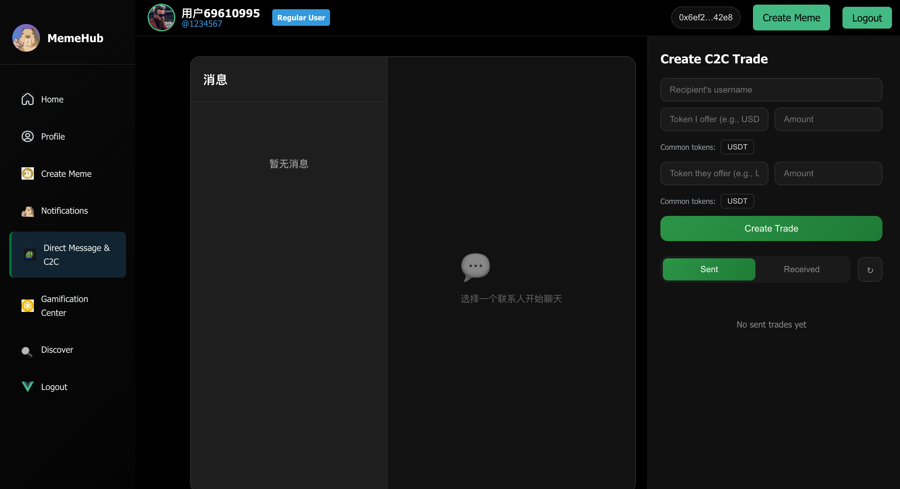
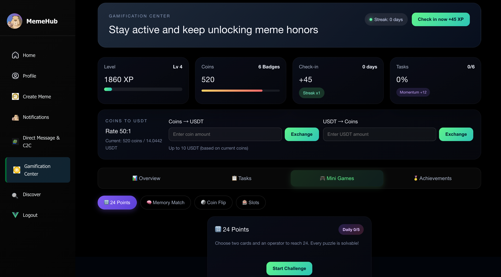
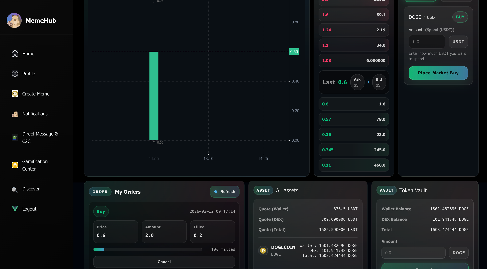

# MemeDex — EasyA Hackathon

A full‑stack meme marketplace and social hub with authentication, profiles, chat, discovery, and gamified community features.

### Demo Video
<video src="assets/video.mp4" controls width="800">
  Your browser does not support the video tag.
</video>

### UI Screenshots
<div align="center">













</div>

## Highlights
- Full auth flow with JWT and MongoDB
- Meme creation, discovery, and social interactions
- Profile system, notifications, and chat modules
- Vue 3 + Vite frontend, Node/Express backend

## Tech Stack
- **Frontend:** Vue 3, Vite
- **Backend:** Node.js, Express
- **Database:** MongoDB (local or Atlas)
- **Auth:** JWT

For a detailed technical breakdown of our parallel execution architecture, storage optimization strategy, and rollback-resistant design, please refer to:

👉 [PARALLEL_EXECUTION_DESIGN.md](PARALLEL_EXECUTION_DESIGN.md)

## Monorepo Layout
- [backend/](backend/) — API server
- [frontend/](frontend/) — Web client

## Quick Start

### 1) Backend
```bash
cd backend
npm install
cp .env_example .env
npm run dev
```

Required environment variables in `.env`:
```
JWT_SECRET=your_secret_here
MONGODB_URI=mongodb://localhost:27017/MemeHub
REVIEWER_REGISTER_SECRET=reviewer-secret
```

The API runs at **http://localhost:3000**.

### 2) Frontend
```bash
cd frontend
npm install
npm run dev
```

The app runs at **http://localhost:5173** (default Vite port).

## Core API (Backend)
- `POST /api/register`
- `POST /api/reviewer/register`
- `POST /api/login`
- `POST /api/reset-password`
- `POST /api/upload-avatar`
- `GET /api/avatars/default`
- `POST /api/avatars/select`

## Scripts

**Backend**
- `npm run dev` — start API with hot reload

**Frontend**
- `npm run dev` — start Vite dev server
- `npm run build` — production build

## Notes
- Use MongoDB Atlas by replacing `MONGODB_URI` with your cluster connection string.
- Keep `JWT_SECRET` and `REVIEWER_REGISTER_SECRET` secure in production.

## License
MIT
